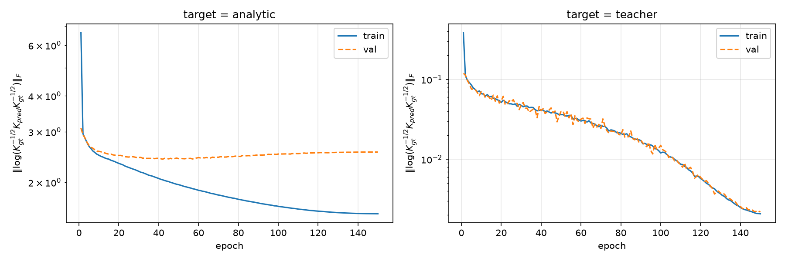

# Experiment B 아키텍처 학습 검증 리포트 (Training Sanity Check)

**기술 보고서**

대상 코드: `experiment/pc_se3_congruence/` — `data_synth.py`, `train.py` (신규), `encoders.py`, `models.py`, `se3_utils.py` (재사용), `core/lie_alg_util.py` (**버그 수정 1건**).
환경: Python 3.11, PyTorch 2.11.0+cu128, NVIDIA RTX 4090, `torch.float64` 전역, 고정 시드.
선행 문서: `pc_se3_congruence_report.md` (구조 검증), `docs/exp.md` (loss 설계 근거).

---

## 0. 결론 요약

> **실험 B 아키텍처(Plücker lift → LNLinear+LNLieBracket → Klein head)는 affine-invariant SPD loss로 문제 없이 학습되며, 두 종류의 target 모두에서 train loss가 정상적으로 감소한다.** 학습 전 과정에서 congruence 등변성과 loss 불변성은 기계정밀도(~1e-15)로 유지된다 — 등변성은 학습되는 성질이 아니라 구조적 성질이므로, 가중치가 어떻게 변하든 깨지지 않음을 학습 실험으로 재확인했다.

| 항목 | analytic target | teacher target |
|---|---|---|
| train $d$ (epoch 1 → 150) | 6.63 → **1.55** (4.3배↓, 단조) | 0.384 → **0.00207** (186배↓) |
| val $d$ (최종) | 2.55 | 0.00218 (train과 gap 없음) |
| 등변성 오차 (학습 후) | 2.7e-15 | 7.8e-16 |
| loss 불변성 오차 (학습 후) | 1.2e-15 | 8.1e-13 |
| 고유값 클램프 발동 | 0회 / 9,600 step | 0회 / 9,600 step |
| NaN/Inf | 없음 | 없음 |

teacher target(모델 클래스 안에 있음이 보장된 target)에서 train·val이 함께 3자리 감소하는 것은 **최적화 자체가 건강함**을, analytic target에서 train이 단조 감소하되 val이 ~2.5에서 정체되는 것은 **모델 클래스 밖 target에 대한 표현력·일반화 한계**를 각각 보여준다 — 후자는 본 실험의 판정 범위 밖이며 후속 과제다(§7).

부수 성과: 학습 하네스 구축 중 `core/lie_alg_util.py`의 `vee_*` 함수들에서 **잠복 dtype 버그**를 발견·수정했다(§6). 전역 default dtype이 float32인 상태에서 float64 모델을 돌리면 bracket 출력이 조용히 float32로 다운캐스트되어, 등변성 오차 바닥이 1e-8에 고정되는 버그다. 기존 `verify.py`는 전역 default를 float64로 바꾸고 실행하기 때문에 이 버그를 관측할 수 없었다.

---

## 1. 목적과 범위

선행 리포트(`pc_se3_congruence_report.md`)는 실험 B 아키텍처가 **랜덤 가중치**에서 합동 등변성

$$K(T\cdot P)=\mathrm{Ad}_T^{-\top}K(P)\,\mathrm{Ad}_T^{-1}$$

을 구조적으로 만족함을 검증했다. 본 실험은 그 다음 단계로, 같은 아키텍처를 키운 모델이 **실제로 학습 가능한지**를 확인한다. 판정 기준은 세 가지다:

1. **학습이 문제 없이 돈다** — NaN/Inf 없음, loss의 고유값 가드가 발동하지 않음.
2. **train loss가 정상적으로 감소한다** — 두 종류의 target 모두에서.
3. **학습이 등변성을 훼손하지 않는다** — 등변성은 가중치 무관 성질이므로 학습 후에도 기계정밀도로 유지되어야 한다 (훼손된다면 구현 버그).

정확도·일반화·표현력 평가는 범위 밖이다(향후 과제, §7).

## 2. 데이터

### 2.1 Point cloud 샘플링 (`data_synth.sample_clouds`)

비등방 Gaussian blob을 임의의 SE(3) pose에 배치한다:

$$P = (z \odot s)\,R^\top + p,\qquad z\sim\mathcal N(0,I_3)^{N},\quad s\sim\mathcal U[0.5,\,2.0]^3,\quad R\sim\text{Haar}(SO(3)),\quad p\sim\mathcal N(0,\,1^2 I_3).$$

- 표본 수: train 4096 / val 512, 점 수 $N=128$.
- 비등방 스케일 $s$가 표본마다 다른 모양을, pose가 다른 위치·방향을 만들어 target $K$의 다양성을 확보한다.
- **병진 스케일을 $\lVert p\rVert\sim1$로 제한한 이유**: `docs/exp.md` T6이 affine-invariant metric의 유효 범위를 명시한다 — $p=0,\lVert p\rVert\sim1$에서 불변성 $<10^{-14}$, 그러나 $\lVert p\rVert\gtrsim10^2$에서는 $\log/\text{inv-sqrt}$의 $\lVert p\rVert^4$ 조건수로 정밀도가 열화된다(1e4에서 2.6e-8). 학습 데이터는 안전 영역 안에 둔다.

### 2.2 Target 1 — 해석적 contact-spring $K$ (`data_synth.contact_spring_K`)

`docs/exp.md` §7.6의 contact-spring 라벨을 pose-free로 옮긴 것. 각 점 $r_i$와 그 $k_{gt}=12$개 최근접 이웃 $r_j$의 쌍이 zero-pitch "접촉 스프링" 렌치

$$w_{ij}=(f,\,m)=(d_{ij},\ r_i\times d_{ij}),\qquad d_{ij}=r_j-r_i$$

를 만들고, SE(3)-불변 강성 가중치 $k(d)=\exp(-\lVert d\rVert^2/2\sigma_k^2)$ ($\sigma_k=0.5$)로 Gram을 쌓는다:

$$K_{gt}(P)=\frac{1}{N k_{gt}}\sum_{i,j} k(\lVert d_{ij}\rVert)\; w_{ij}w_{ij}^\top .$$

**등변성 증명 한 줄**: $w_{ij}$는 `WrenchPlueckerEncoder`와 동일한 순수 힘 렌치 리프팅이므로 $w_{ij}(T\cdot P)=\mathrm{Ad}_T^{-\top}w_{ij}(P)$ (coadjoint), 가중치와 kNN 그래프는 불변 → $K_{gt}(T\cdot P)=\mathrm{Ad}_T^{-\top}K_{gt}\mathrm{Ad}_T^{-1}$이 **정확히** 성립. SPD 여부는 구성상 PSD + 표본별 최소 고유값을 수치 확인(§5).

이 target은 모델과 **독립적**이므로 "진짜 함수를 배우는지"를 보지만, 모델 클래스에 정확히 포함된다는 보장이 없어 loss가 0까지 내려가지 않을 수 있다.

### 2.3 Target 2 — frozen random teacher

동일 아키텍처(§3)의 ModelB를 다른 시드(7)로 초기화해 얼리고 $K_{gt}=\text{teacher}(P)$로 사용한다. target이 모델 클래스 안에 있음이 **보장**되므로 순수한 최적화 sanity check다. 등변성은 teacher 자체가 구조적으로 등변이므로 자동.

같은 point cloud 집합을 두 target이 공유한다(비교 가능성).

## 3. 아키텍처

실험 B 구성 그대로, 크기만 확대. 모든 모듈은 기존 코드 재사용(`ModelB`, `PlueckerEncoder`, `KleinHeadB` — 신규 레이어 없음).

$$P\in\mathbb{R}^{128\times3}
\ \xrightarrow{\ \text{PlückerEncoder}(k=16)\ }\ V\in\mathbb{R}^{6\times16}
\ \xrightarrow{\ \text{LNLinear+LNLieBracket}\times5\ }\ Z\in\mathbb{R}^{6\times32}
\ \xrightarrow{\ Y=QZ,\ K=YY^\top/32\ }\ K\in\mathbb{S}^6_{\succ0}$$

| 구성요소 | 내용 | 파라미터 |
|---|---|---|
| Encoder | `PlueckerEncoder(k=16)` — closed-form 쌍별 Plücker lift, 채널 = 거리순 이웃 rank | 0 |
| Block 0 | `LNLinearAndLieBracket(16→64, 'se3')` | 9,216 |
| Block 1 | `LNLinearAndLieBracket(64→128, 'se3')` | 40,960 |
| Block 2 | `LNLinearAndLieBracket(128→128, 'se3')` | 49,152 |
| Block 3 | `LNLinearAndLieBracket(128→64, 'se3')` | 16,384 |
| Block 4 | `LNLinearAndLieBracket(64→32, 'se3')` | 4,096 |
| Head | `KleinHeadB`: $Y=QZ$ (Klein intertwiner), $K=YY^\top/32$ | 0 |
| **계** | 토이(1.4k) 대비 약 86배 | **119,808** |

- 각 블록 = `LNLinear`(bias 없음, 채널 우측곱) + `LNLieBracket`($x + \mathrm{vee}([\hat d_2,\hat d_1])$, $d_i$는 학습된 채널 혼합). 백본의 비선형성은 Lie bracket뿐 — Killing form·Klein gate·normalization 없음 (선행 리포트 §5의 결론 유지).
- $C_{\text{out}}=32\ge6$이므로 $K$는 generic하게 SPD (rank 조건, exp.md T5).

## 4. Loss — affine-invariant SPD 거리

`docs/exp.md`의 처방(T6 §5.10.6, §7.6)을 그대로 구현:

$$d(K_{gt},K_{pred})=\bigl\lVert\log\bigl(K_{gt}^{-1/2}\,K_{pred}\,K_{gt}^{-1/2}\bigr)\bigr\rVert_F,\qquad \mathcal L=\operatorname{mean}_{\text{batch}}\ d .$$

**왜 이 loss인가** (exp.md의 두 근거): (i) $K^{1/2}$를 쓰는 loss/파라미터화는 $p\ne0$에서 등변성이 깨지지만(T6: $e_{\text{sqrt}}$가 $O(1)$), affine-invariant 거리는 congruence 하에서 양쪽 $\mathrm{Ad}$가 상쇄되어 **불변**이다 — 등변 모델과 합성하면 관측 좌표계에 무관한 목적함수가 된다. (ii) gauge-free다 — eigenscrew axis 같은 축퇴 근방에서 gradient가 발산하는 양을 쓰지 않는다(exp.md §5.9.3).

**구현** (`train.py:affine_invariant_d`): 수치 안정성을 위해 두 가지 표준 변형을 사용한다.

1. **Cholesky whitening**: $K_{gt}=LL^\top$ (데이터이므로 gradient 불필요, 학습 전 1회 계산), $A=L^{-1}K_{pred}L^{-\top}$. $A$는 $K_{gt}^{-1/2}K_{pred}K_{gt}^{-1/2}$와 similar이므로 **고유값이 같다**.
2. **고유값 경로만 미분**: $d^2=\sum_i\log^2\lambda_i(A)$를 `eigvalsh`의 고유값만으로 계산한다. $\log A$ 행렬 재구성이 불필요하고, 고유값의 backward는 $u_iu_i^\top$ 형태라 고유벡터 미분의 $1/(\lambda_i-\lambda_j)$ 항이 아예 등장하지 않는다 — 축퇴 고유값에서도 안정.

가드: $\lambda_i\le10^{-12}$는 클램프하고 발동 횟수를 기록한다. 클램프는 congruence-**불변량**($A$의 고유값)에 걸리므로 loss 불변성을 깨지 않는다. exp.md §3.4가 금지하는 $K+\varepsilon I$류의 정규화(등변성 파괴)는 어디에도 쓰지 않는다.

## 5. 학습 설정 및 결과

### 5.1 하이퍼파라미터

| 항목 | 값 |
|---|---|
| optimizer | Adam, lr $10^{-3}$, cosine annealing → $10^{-5}$ (150 epochs) |
| batch / steps | 64 / 에폭당 64 step, 총 9,600 step |
| gradient clip | global norm 1.0 |
| dtype / device | `torch.float64` / CUDA (RTX 4090) |
| 시드 | data 100, model 0, teacher 7 (모두 고정, 결정론적) |
| 실행 시간 | analytic 107.7 s, teacher 119.1 s (GT 생성·체크 포함) |

### 5.2 Ground-truth SPD 통계 (사전 확인)

Loss가 $K_{gt}^{-1/2}$와 $\log$를 요구하므로 GT의 SPD 여부·조건수를 학습 전에 확인했다 (train 4096 표본 기준):

| | $\lambda_{\min}$ (최소) | $\lambda_{\max}$ (최대) | cond (중앙값) | cond (최대) |
|---|---|---|---|---|
| analytic $K_{gt}$ | 1.7e-3 $>0$ | 0.99 | 18.8 | 584 |
| teacher $K_{gt}$ | 2.8e-8 $>0$ | 1.7e-3 | 133 | 5,155 |

두 target 모두 전 표본 SPD. teacher 출력은 랜덤 초기화 네트워크 특성상 절대 스케일이 작고(~$10^{-4}$) 조건수가 크지만, affine-invariant loss는 스케일 불변이고 float64 Cholesky는 cond ~5e3에서 여유가 충분하다 — 실제로 클램프 가드는 한 번도 발동하지 않았다.

### 5.3 학습 곡선



| epoch | analytic train $d$ | teacher train $d$ |
|---|---|---|
| 1 | 6.634 | 0.384 |
| 10 | 2.486 | 0.0664 |
| 50 | 1.963 | 0.0362 |
| 100 | 1.650 | 0.0120 |
| **150** | **1.555** | **0.00207** |
| val (최종) | 2.550 | 0.00218 |

- **analytic**: train $d$가 150 에폭 내내 단조 감소(6.63→1.55). val은 초반 3.09→2.45까지 내려간 뒤 ~2.5에서 정체하며 소폭 상승 — 경미한 과적합. "학습이 정상 동작하는가"라는 판정 기준에는 영향이 없고, gap의 해석은 §7.
- **teacher**: train과 val이 로그 스케일에서 **붙은 채로** 3자리 감소(0.38→0.002). target이 모델 클래스 안에 있으니 gap이 없는 것이 정확히 기대되는 거동이며, 최적화 경로 자체에 병목이 없음을 보여준다.
- 전 구간 NaN/Inf 없음, 고유값 클램프 0회, $K_{pred}$는 항상 SPD 유지 (최종 $\lambda_{\min}$: analytic 8.4e-3, teacher 8.8e-7 — 후자는 target 스케일 자체가 작은 것을 그대로 추종한 것).

### 5.4 구조 체크 — 학습이 등변성을 건드리지 않음

고정 val 배치(64 표본)에 대해 5개의 랜덤 $T$($\lVert p\rVert\sim1$)로 측정:

| | 학습 전 equiv | 학습 후 equiv | 학습 전 loss-inv | 학습 후 loss-inv |
|---|---|---|---|---|
| analytic | 8.5e-16 | **2.7e-15** | 0.0 | **1.2e-15** |
| teacher | 8.5e-16 | **7.8e-16** | 6.5e-16 | **8.1e-13** |

equiv = $K(T\cdot P)$ vs $\mathrm{Ad}_T^{-\top}K(P)\mathrm{Ad}_T^{-1}$의 스케일 자유 오차, loss-inv = 배치 평균 $d$의 $T$ 변환 전후 상대 변화(GT도 변환된 cloud에서 새로 생성하므로 GT 등변성·모델 등변성·metric 불변성의 합성 검사). 9,600 스텝의 가중치 갱신 후에도 모두 기계정밀도 — **등변성은 학습과 완전히 직교하는 구조적 성질**임이 학습 실험에서도 확인된다. 판정 기준 1·2·3 모두 충족.

## 6. 발견: `vee_*`의 잠복 dtype 버그 (core 수정 1건)

학습 하네스의 첫 스모크 테스트에서 등변성 오차가 학습 전부터 **9.1e-10**으로 나왔다 — 선행 리포트의 1e-15와 6자리 차이. 원인 추적 과정:

1. **CPU vs CUDA 동일** (6.1e-10) → 디바이스 수치 경로 아님. kNN 그래프도 변환 전후 완전 일치 → 인코더 아님 (인코더 단독 오차 4.1e-16).
2. **백본에서 발생** — 블록별 측정 결과 첫 블록부터 ~1e-9. 토이 아키텍처(8→16→16→8)조차 같은 하네스에선 2.2e-9인데 `verify.py`의 A3는 3.6e-16 → 모델·데이터가 아니라 **하네스 차이**.
3. **test 병진 스케일에 무관하게 평평** (p=0에서도 8e-10) → 구조적 결함의 서명($p$에 비례 성장, 음성 대조군의 $O(1)$)이 아니라 round-off 바닥. 그런데 그 바닥의 크기가 float64가 아닌 **float32 수준**(~1e-8 = 단정밀도 $\varepsilon$).
4. 단서는 크기 그 자체였다: [core/lie_alg_util.py:195](../../core/lie_alg_util.py#L195)의

   ```python
   v = torch.zeros(M.shape[:-2]+(6,)).to(M.device)   # 수정 전
   ```

   `torch.zeros`가 **전역 default dtype**으로 생성된다. `verify.py`는 시작 시 `torch.set_default_dtype(torch.float64)`를 호출하므로 문제가 없지만, 전역 default가 float32인 채로 `.double()` 변환 모델을 돌리면(일반적인 float64 학습 관행) float64 bracket 결과가 이 float32 버퍼에 대입되며 **조용히 다운캐스트**된다. `LNLieBracket`의 출력 = $x+\mathrm{vee}(\cdot)$이므로 매 블록마다 float32 반올림이 주입되어 등변성 바닥이 1e-8에 고정된다.

**수정**: `vee_so3`/`vee_sl3`/`vee_se3`/`vee_sp4` 4곳 모두 `torch.zeros(..., dtype=M.dtype, device=M.device)`로 변경. 선행 리포트 §5가 고친 두 건(algebra_type 미전달)과 같은 부류의 세 번째 잠복 버그다.

**수정 검증**:

| 검사 | 수정 전 | 수정 후 |
|---|---|---|
| 학습 하네스 end-to-end 등변성 (test $\lVert p\rVert\in\{0,1,10^2\}$, CPU/CUDA) | 6.1e-10 (평평) | **5.4e-16 – 4.2e-15** |
| `verify.py` 전체 (전역 float64라 버그 비관측 경로) | A3 3.56e-16, B1 7.98e-16 | **동일 수치** (회귀 없음) |
| `docs/scripts/check_layers.py` (float32 회귀) | ~1e-6 수준 | **동일 수준** (float32 자체 한계) |

추가로 `train.py`도 `verify.py`와 같은 관례로 `torch.set_default_dtype(torch.float64)`를 설정한다(이중 방어).

## 7. 논의와 한계

**두 target이 분리해서 보여주는 것.** teacher 실험은 "이 아키텍처·loss·옵티마이저 조합으로 gradient가 제대로 흐르는가"에 대한 통제된 답이다 — target이 실현 가능할 때 train·val이 gap 없이 3자리 내려간다는 것은 bracket 비선형성을 5블록 통과하는 gradient 경로와 eigvalsh 기반 loss의 미분 모두 건강하다는 뜻이다. analytic 실험은 그 위에 "모델 밖의 등변 함수를 얼마나 흡수하는가"를 얹는다: train은 꾸준히 내려가지만 val이 $d\approx2.5$에서 멈추는 것은 최적화가 아니라 **표현력 또는 표본 수**의 한계다.

**analytic gap의 후보 원인 (후속 실험 대상).** (i) 선행 분석이 지적한 bracket-only 백본의 구조적 제약 — $v\to\omega$ blockage와 pitch-blindness — 는 학습을 해도 사라지지 않는 함수 클래스 제한이다. 데이터 의존 게이팅이 없는 현 백본에 wrench–twist pairing $F^\top\xi$ (virtual power) 기반 게이트를 추가하는 것이 선행 리포트 §8이 제시한 자연스러운 다음 수순이다. (ii) 인코더가 $k=16$개 고정 채널의 mean-pool이라 국소 기하 정보가 일찍 압축된다. (iii) 표본 4096개는 과적합 곡선이 보여주듯 넉넉하지 않다. 이들의 분리는 표현력 실험(다른 백본 변형·인코더 채널·데이터 스케일 sweep)으로 넘긴다.

**Loss 구현에 관한 실전 노트.** (i) 고유값-경로만 미분하는 $d=\sqrt{\sum_i\log^2\lambda_i}$ 구현은 9,600 스텝 동안 축퇴·클램프·발산 없이 동작했다 — SPD 학습에서 흔히 문제되는 고유벡터 미분($1/\Delta\lambda$)을 원천 회피한 설계가 유효했다. (ii) teacher target처럼 GT 조건수가 ~5e3인 경우에도 float64에서는 여유가 있었으나, float32 학습 경로(exp.md 실험 F)로 옮기려면 GT 스케일 정규화(det-정규화는 $\det\mathrm{Ad}=1$이라 등변성을 보존한다)를 선행 검토해야 한다. (iii) 병진 스케일을 $\lVert p\rVert\sim1$로 제한한 것은 loss 유효 범위(T6) 안에 머물기 위한 의도적 선택이며, 큰 병진의 데이터가 필요하면 exp.md 실험 F의 앵커 정규화 처방이 선행되어야 한다.

**한계.** 단일 시드·단일 하이퍼파라미터 조합이며(목적이 sanity check이므로), 정확도의 절대 수준·일반화·표현력은 평가하지 않았다. 등변 모델이므로 회전·병진 augmentation은 정의상 불필요하다는 점도 학습 설계에 반영되어 있다(augmented 비교군 없음).

## 부록 A. 재현

```bash
conda activate lieneurons
python experiment/pc_se3_congruence/train.py            # 두 target 모두, 결과/곡선/체크포인트 저장
python experiment/pc_se3_congruence/train.py --quick    # 스모크 테스트 (~수 초)
python experiment/pc_se3_congruence/train.py --target analytic   # 단일 target
```

출력: `experiment/pc_se3_congruence/train_results/` — `{analytic,teacher}_results.json`(설정·GT 통계·구조 체크·에폭별 히스토리), `{analytic,teacher}_model.pt`, `loss_curves.png`.

| 파일 | 역할 |
|---|---|
| `data_synth.py` | cloud 샘플링, 해석적 contact-spring $K_{gt}$, SPD 통계 |
| `train.py` | 모델 구성, affine-invariant loss, 학습 루프, 구조 체크(등변성·loss 불변성), 플롯 |
| `core/lie_alg_util.py` | **수정**: `vee_*` dtype 버그 4곳 (§6) |
